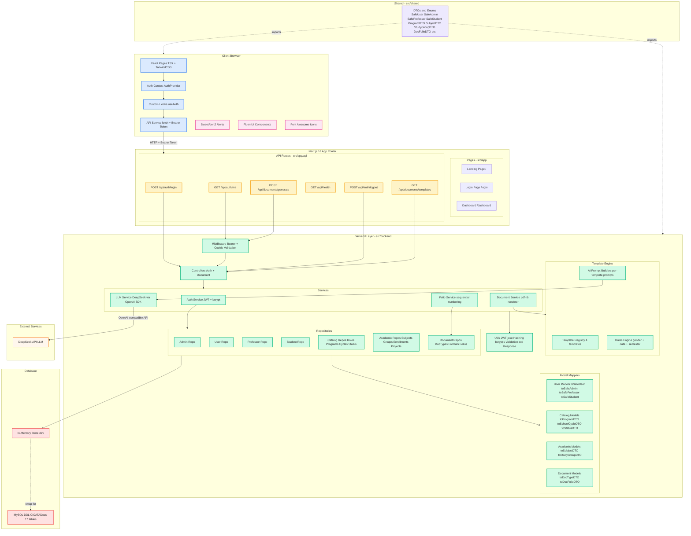
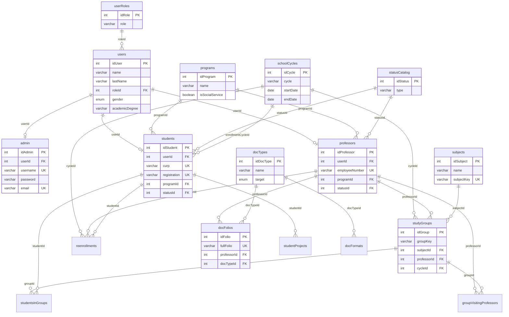

# CICATA — Research Platform MonoRepo

> Centro de Investigación en Ciencia Aplicada y Tecnología Avanzada — IPN
> Full-stack monorepo built with **Next.js 16**, **TypeScript**, and **TailwindCSS v4**

---

## Architecture Diagram



---

## Database Entity Relationship



---

## Project Structure

```
src/
├── app/                            # Next.js App Router
│   ├── (auth)/                     # Public auth pages
│   │   └── login/page.tsx
│   ├── (protected)/                # Auth-guarded pages
│   │   ├── dashboard/page.tsx
│   │   └── layout.tsx              # Client-side auth guard
│   ├── api/                        # API route handlers
│   │   ├── auth/login/route.ts
│   │   ├── auth/me/route.ts
│   │   ├── auth/logout/route.ts
│   │   ├── documents/generate/route.ts
│   │   ├── documents/templates/route.ts
│   │   └── health/route.ts
│   ├── layout.tsx                  # Root layout (AuthProvider + Navbar)
│   ├── page.tsx                    # Landing page
│   └── globals.css
├── backend/                        # Server-side business logic
│   ├── database/                   # DDL-CICATA.sql (MySQL schema)
│   ├── types/                      # DB row types (server-only)
│   ├── middleware/                  # Auth middleware (Bearer + cookie)
│   ├── controllers/                # Request/response orchestration
│   ├── models/                     # Row → DTO mappers (user, catalog, academic, document)
│   ├── repositories/               # Data access layer (7 repo files, 17 tables)
│   ├── routes/                     # Route constant definitions
│   ├── services/                   # Business logic (Auth, Document, Folio, LLM)
│   │   ├── auth.service.ts         # JWT login, token verification
│   │   ├── document.service.ts     # PDF generator (pdf-lib, section renderers)
│   │   ├── folio.service.ts        # Sequential folio numbering
│   │   └── llm.service.ts          # DeepSeek LLM client (OpenAI-compatible)
│   ├── templates/                  # Document template engine
│   │   ├── types.ts                # TemplateDefinition, TemplateContext, AiMetadata
│   │   ├── rules.ts                # Gender/date/semester rules engine
│   │   ├── prompts.ts              # AI prompt builders (per-template)
│   │   ├── constancia-inscripcion.ts
│   │   ├── constancia-reinscripcion.ts
│   │   ├── constancia-promedio.ts
│   │   ├── carta-aceptacion.ts
│   │   └── index.ts                # Template registry
│   └── utils/                      # JWT, hashing, validation, response helpers
├── frontend/                       # Client-side concerns
│   ├── components/
│   │   ├── ui/                     # Button, Input, Card
│   │   └── layouts/                # Navbar, Sidebar
│   ├── hooks/                      # useAuth
│   ├── contexts/                   # AuthContext + AuthProvider
│   ├── types/                      # Client-side type re-exports
│   ├── utils/                      # cn() classname utility
│   └── services/                   # API client with Bearer token
└── shared/                         # Shared types (DTOs, enums)
    ├── types/                      # SafeUser, SafeAdmin, ProgramDTO, SubjectDTO...
    └── constancias/                # Reference PDF scans
```

---

## Tech Stack

| Layer      | Technology                                  |
| ---------- | ------------------------------------------- |
| Framework  | Next.js 16 (App Router, Turbopack)          |
| Language   | TypeScript (strict mode)                    |
| Styling    | TailwindCSS v4                              |
| UI Library | FluentUI React Components                  |
| Icons      | Font Awesome + FluentUI Icons               |
| Alerts     | SweetAlert2                                 |
| Auth       | JWT via jose + httpOnly cookies + Bearer    |
| Hashing    | bcryptjs                                    |
| Validation | zod                                         |
| PDF        | pdf-lib + @pdf-lib/fontkit                  |
| AI / LLM   | DeepSeek (OpenAI-compatible via openai SDK) |
| Utilities  | clsx + tailwind-merge                       |
| Database   | MySQL (DDL provided, in-memory for dev)     |

---

## Getting Started

```bash
# 1. Install dependencies
npm install

# 2. Copy environment variables
cp .env.example .env.local

# 3. Start development server
npm run dev
```

Open http://localhost:3000 in your browser.

---

## API Endpoints

| Method | Endpoint                 | Auth     | Description                                |
| ------ | ------------------------ | -------- | ------------------------------------------ |
| POST   | /api/auth/login          | Public   | Admin login (username or email)            |
| GET    | /api/auth/me             | Bearer   | Get current admin profile                  |
| POST   | /api/auth/logout         | Public   | Clear auth cookie                          |
| GET    | /api/health              | Public   | Health check                               |
| GET    | /api/documents/templates | Bearer   | List available document templates          |
| POST   | /api/documents/generate  | Bearer   | Generate PDF document (optional AI body)   |

### Authentication

Admin-only system — accounts are managed by other admins, no self-registration.

The API supports two token transport mechanisms:
- **Authorization: Bearer \<token\>** header (for API clients)
- **httpOnly cookie** `auth-token` (set automatically on login)

---

## Scripts

```bash
npm run dev       # Start dev server
npm run build     # Production build
npm run start     # Start production server
npm run lint      # ESLint
```

---

## Environment Variables

| Variable              | Description                      | Default                    |
| --------------------- | -------------------------------- | -------------------------- |
| JWT_SECRET            | Secret key for JWT signing       | Required                   |
| JWT_EXPIRATION        | Token expiration time            | 24h                        |
| NEXT_PUBLIC_API_URL   | Base URL for API calls           | http://localhost:3000      |
| NODE_ENV              | Environment                      | development                |
| DEEPSEEK_API_KEY      | DeepSeek API key (AI generation) | Optional                   |
| DEEPSEEK_BASE_URL     | DeepSeek API base URL            | https://api.deepseek.com  |
| DEEPSEEK_MODEL        | DeepSeek model name              | deepseek-chat              |

---

## Design Decisions

- **Admin-based auth**: Only the `admin` table holds credentials. Login uses username or email — there is no self-registration.
- **Repository Pattern**: Data access is abstracted behind repository interfaces backed by in-memory Maps, designed for easy swap to MySQL/Prisma.
- **DB row types vs API DTOs**: Raw DB types (`UserRow`, `AdminRow`, etc.) live in `src/backend/types/` with `server-only`. Safe DTOs (`SafeUser`, `SafeAdmin`, etc.) live in `src/shared/types/` — passwords and BLOBs never reach the client.
- **Constraint enforcement**: Repositories enforce unique keys, composite uniques, max-4 visiting professors per group, and soft-delete filtering — mirroring MySQL triggers.
- **Seeded catalogs**: `StatusCatalogRepository` auto-seeds ACTIVO, INSCRITO, GRADUADO, BAJA TEMPORAL, BAJA DEFINITIVA on module load.
- **Zod validation**: All API inputs are validated with Zod schemas before reaching business logic.
- **Dual token transport**: httpOnly cookies for browser-based auth + Bearer header for API consumers.
- **AI-powered document generation**: DeepSeek LLM generates formal institutional Spanish body text. The AI is a phrasing layer — all factual data (names, dates, folios, grades) comes from the database. Structured JSON output with validation, 15s timeout, graceful fallback to hardcoded templates. Response includes full audit metadata (`ai.aiUsed`, `ai.model`, `ai.promptVersion`, `ai.fallbackReason`).
- **PDF pipeline**: pdf-lib generates PDFs with section-based rendering (header → folio/date → title → body → grades-table → signatures → footer). Templates are TypeScript objects; the rules engine handles gender-aware Spanish.

---

## Document Generation

### Templates

| Template ID                | Name                        | Target  |
| -------------------------- | --------------------------- | ------- |
| constancia-inscripcion     | Constancia de Inscripción   | student |
| constancia-reinscripcion   | Constancia de Reinscripción | student |
| constancia-promedio        | Constancia de Promedio Global | student |
| carta-aceptacion           | Carta de Aceptación         | student |

### AI Mode

Pass `"useAI": true` in the generate request to have DeepSeek LLM write the document body text. The AI receives only sanitized data (name, gender, program, semester, date) — no raw DB records.

```json
{
  "templateId": "constancia-inscripcion",
  "studentId": 1,
  "cycleId": 1,
  "useAI": true
}
```

Response includes audit metadata:
```json
{
  "ai": {
    "aiRequested": true,
    "aiUsed": true,
    "model": "deepseek-chat",
    "promptVersion": "1.0.0"
  }
}
```

If the AI fails or is not configured, the PDF is still generated using the hardcoded template text:
```json
{
  "ai": {
    "aiRequested": true,
    "aiUsed": false,
    "fallbackReason": "DEEPSEEK_API_KEY not configured"
  }
}
```

---

## Postman Collection

Import `postman/CICATA-API.postman_collection.json` into Postman to test all endpoints.

- **Auto-auth**: The Login request saves the token to a collection variable — all subsequent requests use it automatically.
- **20 requests**: Health check, 7 auth tests, 12 document generation tests (4 templates × 2 modes + error cases).
