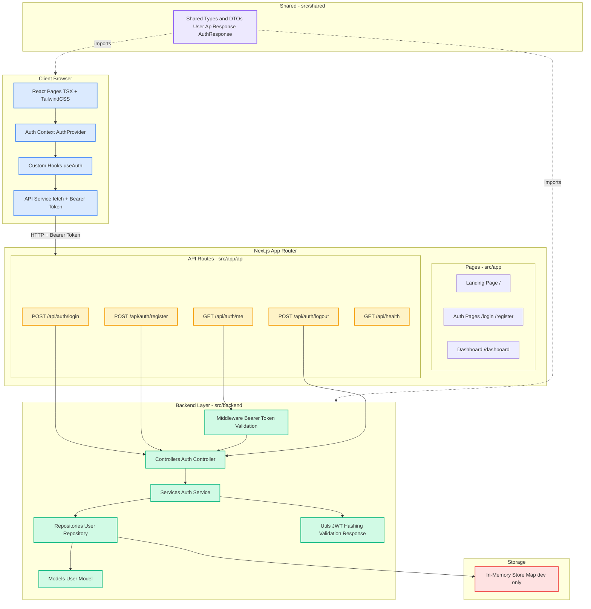

# CICATA — Research Platform MonoRepo

> Centro de Investigación en Ciencia Aplicada y Tecnología Avanzada
> Full-stack monorepo built with **Next.js 16**, **TypeScript**, and **TailwindCSS v4**

---

## Architecture Diagram



---

## Project Structure

```
src/
├── app/                            # Next.js App Router
│   ├── (auth)/                     # Public auth pages (route group)
│   │   ├── login/page.tsx
│   │   └── register/page.tsx
│   ├── (protected)/                # Auth-guarded pages
│   │   ├── dashboard/page.tsx
│   │   └── layout.tsx              # Client-side auth guard
│   ├── api/                        # API route handlers
│   │   ├── auth/login/route.ts
│   │   ├── auth/register/route.ts
│   │   ├── auth/me/route.ts
│   │   ├── auth/logout/route.ts
│   │   └── health/route.ts
│   ├── layout.tsx                  # Root layout (AuthProvider + Navbar)
│   ├── page.tsx                    # Landing page
│   └── globals.css
├── backend/                        # Server-side business logic
│   ├── types/                      # Backend-specific types
│   ├── middleware/                  # Auth middleware (Bearer validation)
│   ├── controllers/                # Request/response orchestration
│   ├── models/                     # Domain models
│   ├── repositories/               # Data access layer (Repository pattern)
│   ├── routes/                     # Route constant definitions
│   ├── services/                   # Business logic layer
│   └── utils/                      # JWT, hashing, validation, response helpers
├── frontend/                       # Client-side concerns
│   ├── components/
│   │   ├── ui/                     # Reusable UI: Button, Input, Card
│   │   └── layouts/                # Navbar, Sidebar
│   ├── hooks/                      # useAuth
│   ├── contexts/                   # AuthContext + AuthProvider
│   ├── types/                      # Client-side type re-exports
│   ├── utils/                      # cn() classname utility
│   └── services/                   # API client with Bearer token
└── shared/                         # Shared types (DTOs, enums)
    └── types/
```

---

## Tech Stack

| Layer      | Technology                          |
| ---------- | ----------------------------------- |
| Framework  | Next.js 16 (App Router)             |
| Language   | TypeScript (strict mode)            |
| Styling    | TailwindCSS v4                      |
| Auth       | JWT via jose + httpOnly cookies     |
| Hashing    | bcryptjs                            |
| Validation | zod                                 |
| Utilities  | clsx + tailwind-merge               |

---

## Getting Started

```bash
# 1. Install dependencies
npm install

# 2. Copy environment variables
cp .env.example .env.local

# 3. Start development server
npm run dev
```

Open http://localhost:3000 in your browser.

---

## API Endpoints

| Method | Endpoint             | Auth     | Description              |
| ------ | -------------------- | -------- | ------------------------ |
| POST   | /api/auth/register   | Public   | Create a new account     |
| POST   | /api/auth/login      | Public   | Authenticate and get token |
| GET    | /api/auth/me         | Bearer   | Get current user profile |
| POST   | /api/auth/logout     | Public   | Clear auth cookie        |
| GET    | /api/health          | Public   | Health check             |

### Authentication

The API supports two token transport mechanisms:
- **Authorization: Bearer <token>** header (for API clients)
- **httpOnly cookie** auth-token (set automatically on login/register)

---

## Scripts

```bash
npm run dev       # Start dev server
npm run build     # Production build
npm run start     # Start production server
npm run lint      # ESLint
```

---

## Environment Variables

| Variable              | Description                   | Default                    |
| --------------------- | ----------------------------- | -------------------------- |
| JWT_SECRET            | Secret key for JWT signing    | Required                   |
| JWT_EXPIRATION        | Token expiration time         | 24h                        |
| NEXT_PUBLIC_API_URL   | Base URL for API calls        | http://localhost:3000      |
| NODE_ENV              | Environment                   | development                |

---

## Design Decisions

- **Repository Pattern**: Data access is abstracted behind a repository interface, making it easy to swap the in-memory store for a real database (Prisma, Drizzle, etc.)
- **server-only imports**: Backend modules use server-only to prevent accidental client-side imports
- **Shared types**: DTOs live in src/shared/types/ to keep frontend and backend contracts in sync
- **Zod validation**: All API inputs are validated with Zod schemas before reaching business logic
- **Dual token transport**: httpOnly cookies for browser-based auth + Bearer header for API consumers
