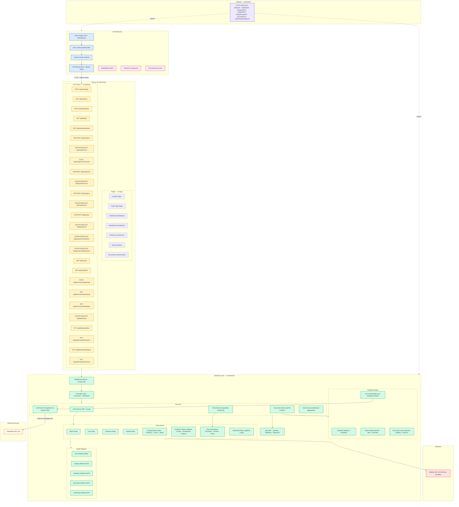
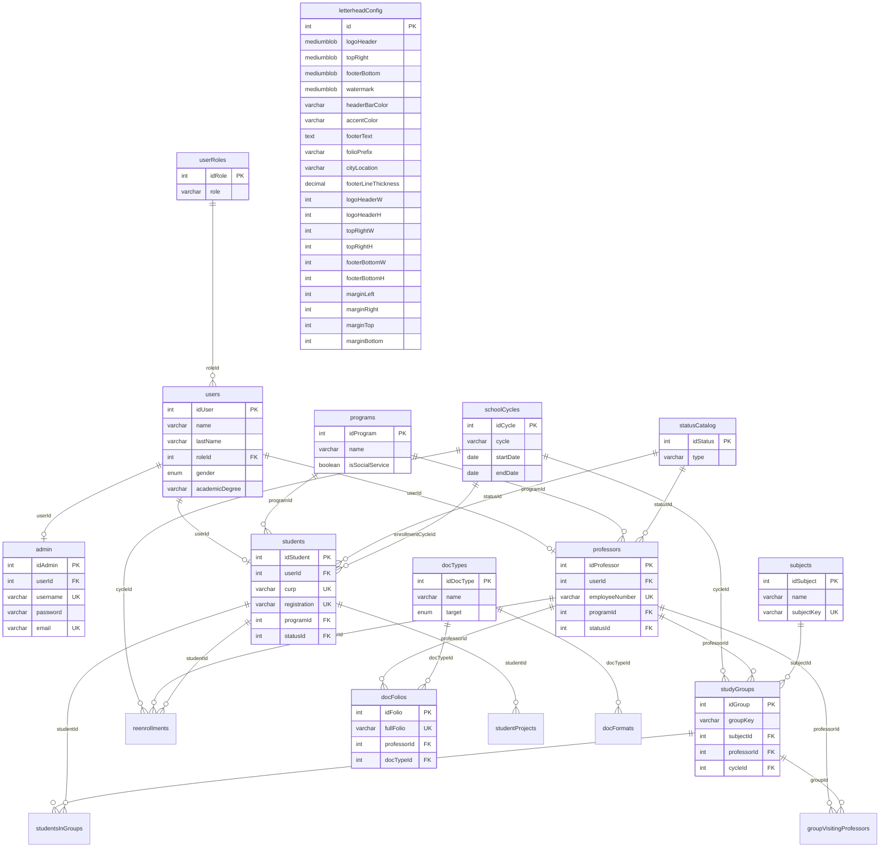

# CICATA — Research Platform MonoRepo

> Centro de Investigación en Ciencia Aplicada y Tecnología Avanzada — IPN
> Full-stack monorepo built with **Next.js 16**, **TypeScript**, and **TailwindCSS v4**

---

## Architecture Diagram



---

## Database Entity Relationship



---

## Project Structure

```
src/
├── app/                              # Next.js App Router
│   ├── login/                        # Public login page
│   │   └── page.tsx
│   ├── (protected)/                  # Auth-guarded pages
│   │   ├── layout.tsx                # Client-side auth guard + sidebar
│   │   ├── dashboard/page.tsx        # Stats dashboard
│   │   ├── estudiantes/page.tsx      # Student CRUD
│   │   ├── profesores/page.tsx       # Professor CRUD
│   │   ├── grupos/page.tsx           # Group management
│   │   └── documentos/page.tsx       # Document generation + letterhead
│   ├── api/                          # API route handlers
│   │   ├── auth/{login,me,logout}/
│   │   ├── students/[id]/
│   │   ├── professors/[id]/
│   │   ├── subjects/[id]/
│   │   ├── groups/[id]/{students,professors}/
│   │   ├── cycles/
│   │   ├── programs/
│   │   ├── documents/{generate,download,templates}/
│   │   ├── letterhead/              # Base: GET config, PUT images+colors, DELETE slot
│   │   │   ├── text/                # PUT footerText, folioPrefix, cityLocation
│   │   │   ├── dimensions/          # PUT image sizes + line thickness
│   │   │   ├── margins/             # PUT page margins (L/R/T/B)
│   │   │   └── watermark/           # PUT watermark image
│   │   ├── stats/dashboard/
│   │   └── health/
│   ├── layout.tsx                    # Root layout (AuthProvider + Navbar)
│   ├── page.tsx                      # Landing page
│   └── globals.css
├── backend/                          # Server-side business logic
│   ├── assets/                       # Static fallback images (IPN logos)
│   ├── database/                     # DDL-CICATA.sql (MySQL schema, 18 tables)
│   ├── types/                        # DB row types (server-only)
│   ├── middleware/                    # Auth middleware (Bearer + httpOnly cookie)
│   ├── controllers/                  # Request → response orchestration
│   │   ├── auth.controller.ts        # Login, me, logout
│   │   ├── document.controller.ts    # Generate, download, templates
│   │   └── letterhead.controller.ts  # Full CRUD + category endpoints
│   ├── models/                       # Row → DTO mappers
│   │   ├── user.model.ts             # toSafeUser, toSafeAdmin, toSafeProfessor, toSafeStudent
│   │   ├── catalog.model.ts          # toProgramDTO, toSchoolCycleDTO, toStatusDTO
│   │   ├── academic.model.ts         # toSubjectDTO, toStudyGroupDTO
│   │   ├── document.model.ts         # toDocTypeDTO, toDocFolioDTO
│   │   └── letterhead.model.ts       # toLetterheadConfigDTO (blob → base64)
│   ├── repositories/                 # Data access layer (8 repo files, 18 tables)
│   │   ├── admin.repository.ts
│   │   ├── user.repository.ts
│   │   ├── student.repository.ts
│   │   ├── professor.repository.ts
│   │   ├── catalog.repository.ts     # Roles, Programs, Cycles, Status
│   │   ├── academic.repository.ts    # Subjects, Groups, Enrollments, Projects
│   │   ├── document.repository.ts    # DocTypes, Formats, Folios
│   │   └── letterhead.repository.ts  # Singleton config (generic update)
│   ├── routes/                       # Route constant definitions
│   ├── services/                     # Business logic
│   │   ├── auth.service.ts           # JWT sign/verify, login flow
│   │   ├── document.service.ts       # PDF renderer (pdf-lib, dynamic Layout)
│   │   ├── folio.service.ts          # Sequential folio numbering
│   │   ├── llm.service.ts            # DeepSeek LLM client (OpenAI SDK)
│   │   └── stats.service.ts          # Dashboard aggregation queries
│   ├── templates/                    # Document template engine
│   │   ├── types.ts                  # TemplateDefinition, TemplateContext, LetterheadOverrides
│   │   ├── rules.ts                  # Gender/date/semester rules
│   │   ├── prompts.ts                # AI prompt builders per template
│   │   ├── document-layout.ts        # Dynamic layout (margins, sections, watermark)
│   │   ├── constancia-inscripcion.ts
│   │   ├── constancia-reinscripcion.ts
│   │   ├── constancia-promedio.ts
│   │   ├── carta-aceptacion.ts
│   │   └── index.ts                  # Template registry
│   └── utils/                        # JWT, hashing, validation, response helpers
├── frontend/                         # Client-side concerns
│   ├── components/
│   │   ├── ui/                       # Button, Input, Card, AnimatedModal
│   │   ├── layouts/                  # Navbar, Sidebar
│   │   ├── dashboard/                # StatCard, ChartWidgets
│   │   ├── students/                 # CreateStudentModal, EditStudentModal, ReenrollModal
│   │   ├── professors/               # CreateProfessorModal, EditProfessorModal
│   │   ├── subjects/                 # CreateSubjectModal, EditSubjectModal
│   │   ├── groups/                   # CreateGroupModal, EditGroupModal, MembersModals
│   │   └── documents/                # GenerateDocumentModal, MembretadoTab
│   ├── hooks/                        # useAuth
│   ├── contexts/                     # AuthContext + AuthProvider
│   ├── types/                        # Client-side type re-exports
│   ├── utils/                        # cn() classname utility
│   └── services/                     # API client with Bearer token
└── shared/                           # Shared types (DTOs, enums)
    ├── types/                        # SafeUser, ProgramDTO, LetterheadConfigDTO...
    └── constancias/                  # Reference PDF scans
```

---

## Tech Stack

| Layer      | Technology                                  |
| ---------- | ------------------------------------------- |
| Framework  | Next.js 16 (App Router, Turbopack)          |
| Language   | TypeScript (strict mode)                    |
| Styling    | TailwindCSS v4                              |
| UI Library | FluentUI React Components                  |
| Icons      | Font Awesome + FluentUI Icons               |
| Alerts     | SweetAlert2                                 |
| Auth       | JWT via jose + httpOnly cookies + Bearer    |
| Hashing    | bcryptjs                                    |
| Validation | zod                                         |
| PDF        | pdf-lib + @pdf-lib/fontkit                  |
| AI / LLM   | DeepSeek (OpenAI-compatible via openai SDK) |
| Utilities  | clsx + tailwind-merge                       |
| Database   | MySQL 8 (18-table DDL provided)             |

---

## Getting Started

```bash
# 1. Install dependencies
npm install

# 2. Copy environment variables
cp .env.example .env.local

# 3. Run MySQL DDL
mysql -u root -p < src/backend/database/DDL-CICATA.sql

# 4. Start development server
npm run dev
```

Open http://localhost:3000 in your browser.

---

## API Endpoints

### Authentication

| Method | Endpoint          | Auth   | Description                     |
| ------ | ----------------- | ------ | ------------------------------- |
| POST   | /api/auth/login   | Public | Admin login (username or email) |
| GET    | /api/auth/me      | Bearer | Get current admin profile       |
| POST   | /api/auth/logout  | Public | Clear auth cookie               |

Admin-only system — no self-registration. Supports dual token transport:
- **Authorization: Bearer \<token\>** header (API clients)
- **httpOnly cookie** `auth-token` (set on login for browsers)

### Students

| Method | Endpoint                     | Auth   | Description                              |
| ------ | ---------------------------- | ------ | ---------------------------------------- |
| GET    | /api/students                | Bearer | List students (paginated, filterable)    |
| POST   | /api/students                | Bearer | Create student                           |
| GET    | /api/students/:id            | Bearer | Get student by ID                        |
| PUT    | /api/students/:id            | Bearer | Update student                           |
| DELETE | /api/students/:id            | Bearer | Delete student                           |
| POST   | /api/students/:id/reenroll   | Bearer | Reenroll student in a new cycle          |

### Professors

| Method | Endpoint              | Auth   | Description                              |
| ------ | --------------------- | ------ | ---------------------------------------- |
| GET    | /api/professors       | Bearer | List professors (paginated, filterable)  |
| POST   | /api/professors       | Bearer | Create professor                         |
| GET    | /api/professors/:id   | Bearer | Get professor by ID                      |
| PUT    | /api/professors/:id   | Bearer | Update professor                         |
| DELETE | /api/professors/:id   | Bearer | Delete professor                         |

### Subjects

| Method | Endpoint             | Auth   | Description                              |
| ------ | -------------------- | ------ | ---------------------------------------- |
| GET    | /api/subjects        | Bearer | List subjects (paginated)                |
| POST   | /api/subjects        | Bearer | Create subject                           |
| GET    | /api/subjects/:id    | Bearer | Get subject by ID                        |
| PUT    | /api/subjects/:id    | Bearer | Update subject                           |
| DELETE | /api/subjects/:id    | Bearer | Delete subject                           |

### Groups

| Method | Endpoint                       | Auth   | Description                              |
| ------ | ------------------------------ | ------ | ---------------------------------------- |
| GET    | /api/groups                    | Bearer | List groups (paginated, filterable)      |
| POST   | /api/groups                    | Bearer | Create group                             |
| GET    | /api/groups/:id                | Bearer | Get group by ID                          |
| PUT    | /api/groups/:id                | Bearer | Update group                             |
| DELETE | /api/groups/:id                | Bearer | Delete group                             |
| GET    | /api/groups/:id/students       | Bearer | List students in group                   |
| POST   | /api/groups/:id/students       | Bearer | Add student to group                     |
| DELETE | /api/groups/:id/students       | Bearer | Remove student from group                |
| GET    | /api/groups/:id/professors     | Bearer | List visiting professors in group        |
| POST   | /api/groups/:id/professors     | Bearer | Add visiting professor (max 4)           |
| DELETE | /api/groups/:id/professors     | Bearer | Remove visiting professor                |

### Catalogs

| Method | Endpoint        | Auth   | Description               |
| ------ | --------------- | ------ | ------------------------- |
| GET    | /api/cycles     | Bearer | List school cycles        |
| GET    | /api/programs   | Bearer | List academic programs    |

### Documents

| Method | Endpoint                    | Auth   | Description                                |
| ------ | --------------------------- | ------ | ------------------------------------------ |
| GET    | /api/documents/templates    | Bearer | List available document templates          |
| POST   | /api/documents/generate     | Bearer | Generate PDF document (optional AI body)   |
| GET    | /api/documents/download     | Bearer | Download generated PDF by folio            |

### Letterhead (Membretado)

The letterhead API manages the institutional document branding — logos, colors, footer text, dimensions, margins, and watermark. All settings are stored as a singleton row in the `letterheadConfig` table.

| Method | Endpoint                      | Auth   | Description                                       |
| ------ | ----------------------------- | ------ | ------------------------------------------------- |
| GET    | /api/letterhead               | Bearer | Get full letterhead configuration                 |
| PUT    | /api/letterhead               | Bearer | Update images (base64) + colors (backward-compat) |
| DELETE | /api/letterhead               | Bearer | Clear an image slot (body: `{ "slot": "..." }`)   |
| PUT    | /api/letterhead/text          | Bearer | Update footer text, folio prefix, city/location   |
| PUT    | /api/letterhead/dimensions    | Bearer | Update image sizes + footer line thickness        |
| PUT    | /api/letterhead/margins       | Bearer | Update page margins (left, right, top, bottom)    |
| PUT    | /api/letterhead/watermark     | Bearer | Upload or clear watermark image                   |

#### PUT /api/letterhead/text

```json
{
  "footerText": "Boulevard de la Tecnología, 1036, Atlacholoaya...",
  "folioPrefix": "SIP-DI-DDCYT-CICATAMOR-",
  "cityLocation": "Xochitepec, Morelos"
}
```

#### PUT /api/letterhead/dimensions

```json
{
  "logoHeaderW": 350, "logoHeaderH": 65,
  "topRightW": 90,    "topRightH": 90,
  "footerBottomW": 80, "footerBottomH": 80,
  "footerLineThickness": 1.8
}
```

#### PUT /api/letterhead/margins

Values in PDF points (72 points = 1 inch).

```json
{
  "marginLeft": 72,
  "marginRight": 72,
  "marginTop": 72,
  "marginBottom": 72
}
```

#### PUT /api/letterhead/watermark

```json
{ "watermark": "<base64-encoded-png>" }
```

To remove the watermark:
```json
{ "watermark": null }
```

#### Image slots

The base `PUT /api/letterhead` endpoint accepts image slots as base64:

| Slot           | Description                       | Max Size |
| -------------- | --------------------------------- | -------- |
| `logoHeader`   | Top-left institutional logo       | 5 MB     |
| `topRight`     | Top-right badge / secondary logo  | 5 MB     |
| `footerBottom` | Footer-left image                 | 5 MB     |
| `watermark`    | Centered semi-transparent overlay | 5 MB     |

### Dashboard

| Method | Endpoint             | Auth   | Description                       |
| ------ | -------------------- | ------ | --------------------------------- |
| GET    | /api/stats/dashboard | Bearer | Aggregated counts and stats       |
| GET    | /api/health          | Public | Health check                      |

---

## Document Generation

### Templates

| Template ID                | Name                          | Target  |
| -------------------------- | ----------------------------- | ------- |
| constancia-inscripcion     | Constancia de Inscripción     | student |
| constancia-reinscripcion   | Constancia de Reinscripción   | student |
| constancia-promedio        | Constancia de Promedio Global | student |
| carta-aceptacion           | Carta de Aceptación           | student |

### PDF Pipeline

The document service uses **pdf-lib** with a section-based rendering approach:

1. **Layout computation** — dynamic margins from `letterheadConfig` (fallback: 72pt all sides)
2. **Header** — institutional logos with configurable dimensions
3. **Folio / Date** — auto-generated sequential folio with configurable prefix
4. **Title** — centered bold template title
5. **Body** — AI-generated or hardcoded formal Spanish text
6. **Grades table** — (constancia-promedio only) student transcript
7. **Signatures** — director signature block
8. **Watermark** — centered at 8% opacity (if configured)
9. **Footer** — colored line + address text with configurable thickness/colors

### AI Mode

Pass `"useAI": true` to have DeepSeek LLM write the body text. The AI receives only sanitized data — no raw DB records.

```json
{
  "templateId": "constancia-inscripcion",
  "studentId": 1,
  "cycleId": 1,
  "useAI": true
}
```

Response includes audit metadata:
```json
{
  "ai": {
    "aiRequested": true,
    "aiUsed": true,
    "model": "deepseek-chat",
    "promptVersion": "1.0.0"
  }
}
```

If the AI fails or is not configured, the PDF still generates using hardcoded template text:
```json
{
  "ai": {
    "aiRequested": true,
    "aiUsed": false,
    "fallbackReason": "DEEPSEEK_API_KEY not configured"
  }
}
```

---

## Letterhead Customization (Membretado)

The **MembretadoTab** in the Documentos page provides a full letterhead customization UI:

| Category       | Fields                                                      | Endpoint                    |
| -------------- | ----------------------------------------------------------- | --------------------------- |
| Images         | logoHeader, topRight, footerBottom (drag-and-drop upload)    | PUT /api/letterhead         |
| Colors         | headerBarColor, accentColor (hex color pickers)             | PUT /api/letterhead         |
| Text           | footerText, folioPrefix, cityLocation                       | PUT /api/letterhead/text    |
| Line thickness | footerLineThickness (0.5–5.0 pt slider)                     | PUT /api/letterhead/dimensions |
| Image sizes    | logoHeaderW/H, topRightW/H, footerBottomW/H (PDF points)   | PUT /api/letterhead/dimensions |
| Page margins   | marginLeft, marginRight, marginTop, marginBottom (PDF pts)  | PUT /api/letterhead/margins |
| Watermark      | Semi-transparent centered overlay image (8% opacity)        | PUT /api/letterhead/watermark |

All changes are staged client-side and committed with a single "Guardar Cambios" action. A live document mockup preview updates in real-time as settings change.

---

## Scripts

```bash
npm run dev       # Start dev server (Turbopack)
npm run build     # Production build
npm run start     # Start production server
npm run lint      # ESLint
```

---

## Environment Variables

| Variable              | Description                      | Default                    |
| --------------------- | -------------------------------- | -------------------------- |
| JWT_SECRET            | Secret key for JWT signing       | Required                   |
| JWT_EXPIRATION        | Token expiration time            | 24h                        |
| NEXT_PUBLIC_API_URL   | Base URL for API calls           | http://localhost:3000      |
| NODE_ENV              | Environment                      | development                |
| DB_HOST               | MySQL host                       | localhost                  |
| DB_PORT               | MySQL port                       | 3306                       |
| DB_USER               | MySQL user                       | Required                   |
| DB_PASSWORD           | MySQL password                   | Required                   |
| DB_NAME               | MySQL database name              | CICATADocs                 |
| DEEPSEEK_API_KEY      | DeepSeek API key (AI generation) | Optional                   |
| DEEPSEEK_BASE_URL     | DeepSeek API base URL            | https://api.deepseek.com  |
| DEEPSEEK_MODEL        | DeepSeek model name              | deepseek-chat              |

---

## Design Decisions

- **Admin-based auth**: Only the `admin` table holds credentials. Login uses username or email — no self-registration.
- **Repository pattern**: Data access is abstracted behind typed repositories backed by MySQL via mysql2/promise with connection pooling.
- **DB row types vs API DTOs**: Raw DB types (`UserRow`, `AdminRow`, etc.) live in `src/backend/types/` with `server-only`. Safe DTOs live in `src/shared/types/` — passwords and BLOBs never reach the client (images are converted to base64 in the model mapper).
- **Constraint enforcement**: Repositories enforce unique keys, composite uniques, max-4 visiting professors per group.
- **Zod validation**: All API inputs are validated with Zod schemas before reaching business logic.
- **Dual token transport**: httpOnly cookies for browser auth + Bearer header for API consumers.
- **Dynamic PDF layout**: The document service computes margins, image dimensions, and footer properties from the `letterheadConfig` DB row at render time — no hardcoded values.
- **AI-powered generation**: DeepSeek LLM generates formal institutional Spanish text. It's a phrasing layer — all factual data comes from the database. Structured JSON output with validation, 15s timeout, graceful fallback to hardcoded templates.
- **Singleton letterhead config**: Single row (id=1) in `letterheadConfig`. The repository uses a generic `update(fields)` method with dynamic SQL `SET` clauses.
- **Category-split letterhead API**: Text, dimensions, margins, and watermark each have dedicated endpoints for granular updates, while the base `/api/letterhead` remains backward-compatible for images + colors.

---

## Postman Collection

Import `postman/CICATA-API.postman_collection.json` into Postman to test all endpoints.

- **Auto-auth**: The Login request saves the token to a collection variable — all subsequent requests use it automatically.
- **20 requests**: Health check, 7 auth tests, 12 document generation tests (4 templates × 2 modes + error cases).
